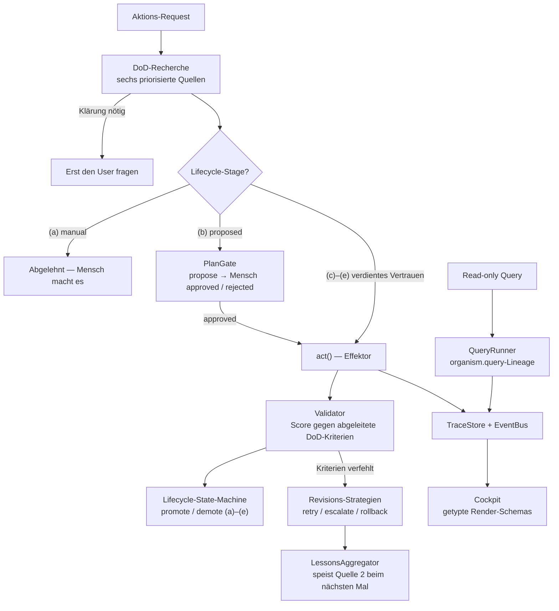

*[🇬🇧 English version](README.md)*

# organism-core

[](https://github.com/organism-core/organism-core/actions/workflows/ci.yml)
[](LICENSE)
[](pyproject.toml)

**Multi-Tool-KI-Orchestrierung, die ihre Erfolgskriterien recherchiert, bevor sie handelt — sie nach der Aktion validiert — und sich Autonomie aus der eigenen Erfolgsbilanz verdient.**

Bevor ein KI-Tool losläuft, klärt organism-core: *Was heißt „fertig" hier konkret?* Nach der Aktion prüft es das Ergebnis gegen genau diese Kriterien. Tools, die wiederholt sauber arbeiten, dürfen mehr allein machen; Tools, die driften, werden automatisch zurückgestuft. Ein Harness, den man an einem Nachmittag liest — self-hostable, Apache 2.0.

> **Status:** Feature-vollständige Referenz-Implementierung, pre-1.0. 900 Tests grün. [Phasenstand](#phasenstand).
>
> **The Advanced Agentic Harness** — fertiges Referenz-Pattern-Set, gepflegt im Erhaltungsmodus. **organism-core Cloud** *(in Evaluierung)*: hosted Approval-Gate & Audit-Reports, EU-gehostet (GDPR-first), ausgelegt auf EU-AI-Act-Art.-14-Nachweise. Waitlist auf [brachia.dev](https://brachia.dev) · `info@brachia.dev`.

<p align="center">
  
</p>

## Was ist das?

Ein Pattern-Set für Systeme, in denen mehrere KI-Tools parallel arbeiten und ihre Ergebnisse in einen zentralen Wahrheits-Speicher konsolidieren. Das Skelett liefert die generischen Bausteine (DoD-Engine, Lifecycle-State-Machine, Plan-Gate, Lessons-Aggregator, Trace-Store, EventBus, Cockpit). Du implementierst die konkreten Tools für deine Domäne — den Rest bringt das Framework mit.

## Warum gibt es das?

Entstanden in einem aktiven Architekturbüro mit ~300 laufenden Projekten. Wir brauchten ein Agenten-System, das aus Korrekturen lernt statt Fehler zu wiederholen, und das sich Autonomie verdient statt sie zugesprochen zu bekommen.

## So funktioniert es

Stell dir vor, du willst, dass eine KI für dich automatisch eine Aufgabe erledigt — etwa einen Grundriss auswerten, eine Eingangsmail beantworten, eine Steuererklärung prüfen. Bevor die KI losläuft, fragt organism-core eine andere Frage: **Was heißt „fertig" eigentlich konkret — bei diesem Projekt, in diesem Kontext, in diesem Moment?**

Die Antwort sucht das Skelett an sechs Stellen, von der konkreten zur allgemeinen:

1. **Im Projekt-Dossier selbst** — steht dort schon, was diese Aufgabe leisten soll? (Beispiel: „Die Auswertung muss mindestens 12 Räume zeigen.")
2. **In früheren Erfahrungen** — was haben wir bei ähnlichen Aufgaben gelernt? (Beispiel: „Letztes Mal hat die KI Türen vergessen — wir achten jetzt auf vollständige Türlisten.")
3. **In verwandten Projekten** — wie wurde diese Aufgabe in ähnlichen Fällen erledigt?
4. **In einer semantischen Suche** über die vorhandene Wissensbasis — gibt es ähnlich gelagerte Vorgänge im Archiv?
5. **In Domänen-Mustern** — was sind die üblichen Anforderungen bei dieser Art von Aufgabe?
6. **Beim Menschen** — wenn alles oben nicht ausreicht, kommt eine Rückfrage.

Aus diesen sechs Antworten setzt das Skelett eine konkrete Liste zusammen — die **Definition of Done**. Erst dann startet die KI ihre eigentliche Arbeit. Am Ende prüft das Skelett: Erfüllt das Ergebnis diese Liste?

- **Wenn ja:** das Ergebnis wird abgelegt, der zuständige Tool-Pfad verdient sich ein Stück Vertrauen.
- **Wenn nein:** das Skelett entscheidet automatisch nach festgelegten Regeln — noch ein Versuch mit anderen Parametern, eine Eskalation an einen Menschen, oder ein sauberer Rückzug.

Über die Zeit sammelt das System Erfahrungen aus Erfolgen und Misserfolgen und schickt sie beim nächsten Mal als Quelle 2 wieder mit ein. Tools, die wiederholt sauber arbeiten, steigen automatisch in eine höhere Vertrauens-Stufe auf; Tools, die zu oft danebenliegen, werden zurückgestuft. Das ist der **Quality Gate**, der organism-core von anderen Multi-Agent-Frameworks unterscheidet: Die KI muss sich ihre Autonomie verdienen, sie bekommt sie nicht geschenkt.

*(Einige deutschstämmige Begriffe bleiben bewusst Projekt-Vokabular — Skelett, Wesen, DoD-Recherche. Siehe das [Mini-Glossar](docs/TRANSLATION_GUIDE.md#mini-glossary--project-vocabulary).)*

## Was macht das anders

Die Einzelteile sind nicht der Punkt — die großen Plattformen haben die meisten davon. Der Punkt ist, dass niemand sie **zu einem Execution-Pfad verschmolzen** shippt: DoD-Recherche → Plan-Gate → verdiente Autonomie → Validierung → persistente Lessons. organism-core ist genau dieser Pfad, als provider-agnostischer Harness.

Drei Primitive tragen den Unterschied:

1. **Persistente Cross-Arm-Lessons.** Was bei einer Verfehlung gelernt wurde, wird destilliert, gespeichert und beim nächsten Mal wieder eingespeist — auch über Aktionstypen hinweg. Rubric-Feedback-Loops gibt es inzwischen viele; eine strukturierte, konfigurierbare Verteilung dieser Lessons über Domänen hinweg als First-Class-Baustein, soweit wir sehen, sonst niemand.

2. **Verdiente Autonomie pro Aktionstyp.** Tools steigen über demonstrierte Qualität durch fünf Vertrauens-Stufen `(a)→(e)` — pro Aktionstyp, nicht pro Agent. Die Erfolgskriterien dafür werden vor jeder Aktion frisch recherchiert, nicht einmal fest verdrahtet.

3. **Auto-Demotion als Sicherheits-Feature.** Verliehene Autonomie ist per Konstruktion widerrufbar: Sinkt die Qualität im Score-Fenster, wird der Aktionstyp automatisch zurückgestuft. Das ist kein nachgerüstetes Policy-Feature, sondern in die Architektur eingebaut.

*(Wie sich das in die Industrie-Landschaft 2026 einordnet — Anthropic Outcomes, EU AI Act Art. 14, OWASP Agentic Top 10, MCP/A2A, die einschlägige Forschung — steht in [`docs/ARCHITEKTUR/10_LANDSCHAFT.md`](docs/ARCHITEKTUR/10_LANDSCHAFT.md), mit datierten Quellen.)*

## Architektur



Das Skelett liefert alles in diesem Diagramm außer den zwei Bausteinen, die du selbst füllst: **Effektoren** (side-effecting Tools, 5-Kontakt-Vertrag) und **Querier** (deterministische Reads, 2-Kontakt-Vertrag).

## Quick Start

```bash
git clone https://github.com/organism-core/organism-core.git
cd organism-core
pip install -e ".[dev]"

python -m examples.architect_lite    # oder tax_lite / cfo_lite
python -m examples.full_recherche    # der 6-Quellen-DoD-Walk
python -m examples.cockpit_demo      # der headless UI-Layer
pytest tests/
```

Noch nicht auf PyPI — Installation aus dem Quellcode wie oben gezeigt. Die drei Domain-Demos drucken einen vollen Pipeline-Walk und produzieren **identische Pipeline-Counts** — Cross-Domain-Verifikation als executable spec.

## Eigenen Effector definieren

Die komplette Konsumenten-Oberfläche in ~40 Zeilen — ein Effector mit den zwei Kontakten die du überschreibst, verdrahtet in den Orchestrator, ein voller propose → approve → apply-Roundtrip (`tests/examples/test_readme_example.py` hält das Beispiel in CI ehrlich):

```python
import tempfile
from pathlib import Path

from organism.adapter import BaseEffector
from organism.dod import DoDEngine, DoDEngineSettings, DoDValidator, default_sources
from organism.lifecycle import LifecycleManager, LifecycleStore
from organism.memory import Entity, EntityStore
from organism.orchestrator import ActionOrchestrator
from organism.plan_gate import PlanGate, PlanStore


class GreetingEffector(BaseEffector):
    name = "greeting_effector"

    def define_done(self, request, context):
        return {}  # die DoD-Engine leitet die Kriterien ab

    def act(self, request):
        return {"greeting_present": True}


root = Path(tempfile.mkdtemp())
entities = EntityStore(root / "entities")
entities.write("demo-entity", Entity(frontmatter={
    "dod": {"criteria": [{"name": "greeting_present", "expected": True}]},
}))

orchestrator = ActionOrchestrator(
    engine=DoDEngine(
        sources=default_sources(entity_store=entities),
        settings=DoDEngineSettings(threshold=0.5),
    ),
    validator=DoDValidator(),
    plan_gate=PlanGate(store=PlanStore(root / "plans")),
    lifecycle=LifecycleManager(store=LifecycleStore(root / "lifecycle")),
)

effector = GreetingEffector()
result = orchestrator.execute(
    effector, kind="say_hello", request="hello",
    context={"entity_id": "demo-entity"},
)
print(result.status)  # ActionStatus.PROPOSED — wartet auf menschliche Freigabe

orchestrator.plan_gate.approve(result.plan.id, decided_by="you")
applied = orchestrator.apply_approved_plan(result.plan.id, effector)
print(applied.status, applied.validation.score)  # ActionStatus.APPLIED 1.0
```

Der neue `kind` startet in Lifecycle-Stage `(b) proposed` — jede Aktion läuft durchs PlanGate, bis die Score-Historie eine Promotion verdient hat. Genau das ist der Quality Gate bei der Arbeit.

## Tiefer einsteigen

| Du willst | Lies |
|---|---|
| Die ganze Idee in einem Dokument | [`docs/M5_WHITEPAPER.de.md`](docs/M5_WHITEPAPER.de.md) |
| Engine, Lifecycle, Observability im Detail | [`docs/STAR.de.md`](docs/STAR.de.md) · [`docs/LIFECYCLE.de.md`](docs/LIFECYCLE.de.md) · [`docs/OBSERVABILITY.de.md`](docs/OBSERVABILITY.de.md) |
| Patterns: Transfers, Produktions-Default, MCP | [`docs/RECEIPTED_TRANSFER.md`](docs/RECEIPTED_TRANSFER.md) · [`docs/PRODUCTION_DEFAULT.md`](docs/PRODUCTION_DEFAULT.md) · [`docs/MCP_DESIGN.md`](docs/MCP_DESIGN.md) |
| Alles, mit Lesepfaden | [`docs/README.de.md`](docs/README.de.md) |

## Module

| Pfad | Aufgabe |
|---|---|
| `src/organism/dod/` | DoD-Recherche-Engine (Star-Pattern, M5) — das Kernstück |
| `src/organism/adapter/` · `src/organism/query/` | Effektor-Vertrag (schreibend) · Querier-Lineage (read-only) |
| `src/organism/plan_gate/` · `src/organism/lifecycle/` | Approve/Reject-Gate · Vertrauens-Stufen `(a)→(e)` |
| `src/organism/lessons/` · `src/organism/memory/` | Lessons-Aggregator · Entity-Memory (YAML+MD, schema-frei) |
| `src/organism/observability/` · `src/organism/provenance/` | Traces, EventBus, ToolRegistry, OTel-Konverter · Provenance-Container |
| `src/organism/orchestrator/` · `src/organism/ui/` | ActionOrchestrator (Stage-Routing, Revisions-Loop) · headless Cockpit |
| `src/organism/settings/` | admin-sichtbare, YAML-roundtripbare Settings |

Demos liegen in `examples/` (architect_lite / tax_lite / cfo_lite + full_recherche + cockpit_demo), je ~300 Zeilen, als Vorlage geeignet. Alle Stores sind file-basiert — die Wahrheit bleibt menschenlesbares YAML + Markdown.

## Phasenstand

| Phase | Status | Inhalt |
|---|---|---|
| 0–6 | ✅ | Skelett-MVP: Memory, Effektor-Vertrag, DoD-Engine + 6 Quellen + Validator, Settings, Plan-Gate, Lifecycle, Orchestrator, Provenance, Traces, Lessons, EventBus, OTel, 3 Demos + Cross-Demo-Wächter, Doku-Konsolidierung, LICENSE + CI |
| 7 | ✅ | M5-Patch-Code: evaluator-Schalter (rule / self_check / llm_judge), geschlossener Lesson-Loop, Revisions-Strategien pro Kriterium, operative Settings |
| UI · Q | ✅ | Cockpit-Wesen + getypte Render-Schemas · Querier-Lineage mit QueryTrace |
| 8A–8C | ✅ | Outcomes-Alignment: `REVISION_OUTCOME_FAILED`, `MarkdownRubricSource` (Outcomes-Rubric-Interop), `CrossDomainLessonsSource` |
| P1 · P2 · P3-mini | ✅ | Batched `llm_judge` (N→1 Calls) · paralleler Source-Dispatch · Lesson-Pile-Sensor |
| S | ✅ | Drei ehemalige Stub-Quellen echt; `default_sources()` liefert 8 Instanzen |

Geplante Erweiterungen (ohne Termine): dLLM-Integration · Reentrance-Trigger 1–2 ([`docs/REENTRANCE.md`](docs/REENTRANCE.md)) · was sich zuletzt geändert hat: [`docs/RELEASE_NOTES_v0.3.0.md`](docs/RELEASE_NOTES_v0.3.0.md).

## Test

```bash
pytest tests/
```

900 Tests grün, darunter zwei Trenn-Test-Wächter (Action- und Query-Seite), die identische Counts über alle drei Demo-Domains erzwingen, und ein Wächter, der das README-Beispiel gegen die echte API kompilierbar hält.

## License

Apache License 2.0 — siehe [`LICENSE`](LICENSE). Contributions laufen unter dem CLA des Projekts (siehe [`CLA.md`](CLA.md)); das Copyright an deinem Beitrag bleibt bei dir.

---

*Mensch ist Kurator, KI ist Vorschlag.*
