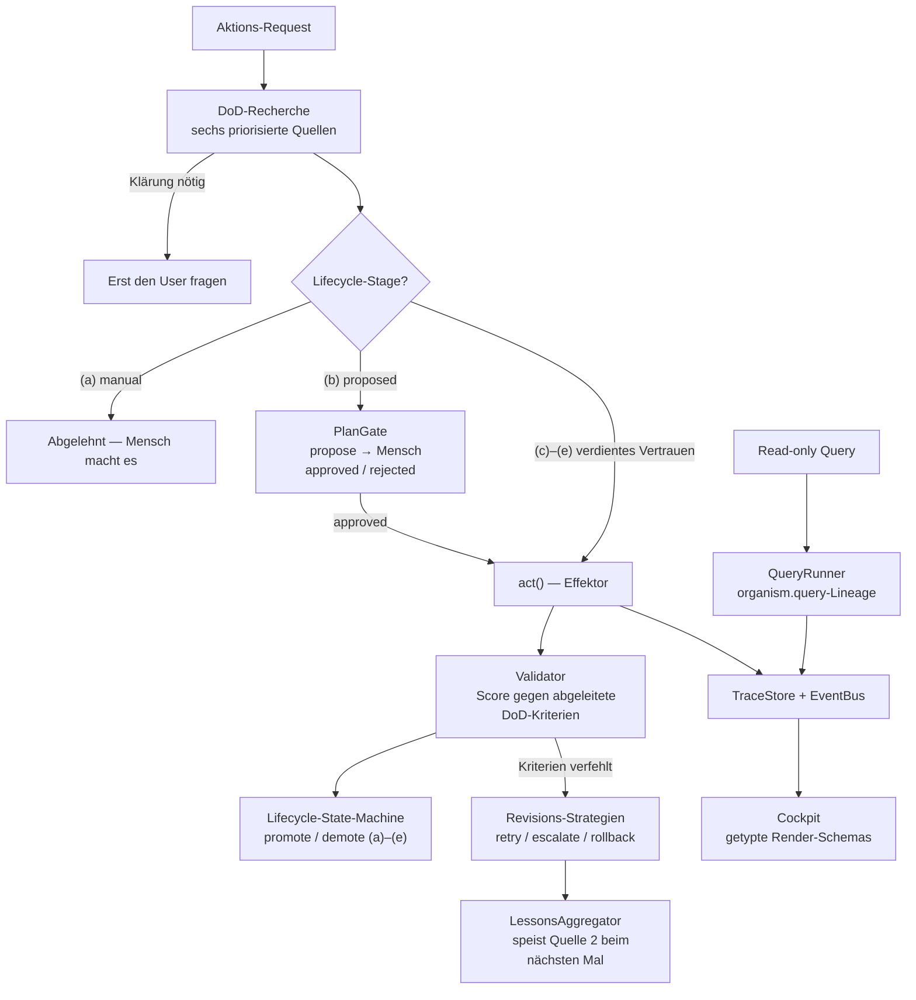

*[🇬🇧 English version](README.md)*

# organism-core

[](https://github.com/organism-core/organism-core/actions/workflows/ci.yml)
[](LICENSE)
[](pyproject.toml)

**Quality-gated multi-tool AI orchestration.**

Referenz-Implementierung, die vor jeder Aktion eine Definition-of-Done recherchiert, das Ergebnis gegen die abgeleiteten Kriterien validiert und Lifecycle-Stages aus dem Score-Verlauf treibt.

## Industrie-Konvergenz — Mai 2026

In einer einzigen Woche im Mai 2026 haben drei Top-Tier-Akteure Designs veröffentlicht, die auf dasselbe Meta-Problem zielen: das monolithische Request-Response-Modell passt nicht zur Realität laufender User-Aufmerksamkeit und kontinuierlicher Agent-Aktion.

- **Anthropic Outcomes** (Mitte Mai 2026) — explizite Erfolgskriterien vor der Aktion, Validierung danach. Architektonisch verwandt mit organism-cores M5-DoD-Recherche-Pattern.
- **TML Interaction Models** (Thinking Machines Lab, Research-Preview 12. Mai) — „listen, speak, see, pause" im Netz selbst trainiert; full-duplex; ~0,4 s Antwortzeit. Löst Turn-Taking auf der **Architektur-Schicht**.
- **Google Android Halo** (19. Mai, I/O) — persistenter Agent-Status-Indikator in der Android-Statusbar, ab Android 17 in diesem Jahr. Macht laufende Agent-Aktion sichtbar auf der **OS-/UI-Schicht**.

organism-core adressiert dasselbe Meta-Problem auf einer dritten Ebene — der **Protokoll-Schicht**. Plan-Gate + Lifecycle + DoD-Engine + das reservierte Reentrance-Pattern (siehe [`docs/REENTRANCE.md`](docs/REENTRANCE.md)) liefern Mid-Execution-Human-in-the-Loop mit auditierbarem Trail über mehrere Tools.

Die vier Ansätze konkurrieren nicht, sie liegen übereinander:

| Schicht | Beispiel | Was es löst |
|---|---|---|
| Provider | Anthropic Outcomes | Erfolgskriterien als first-class API |
| Architektur (Modell) | TML Interaction Models | bidirektionale Aufmerksamkeit mitten in der Äußerung |
| **Protokoll (Orchestrierung)** | **organism-core** | **Mid-Execution-HITL mit Audit-Trail** |
| UI (OS / App) | Android Halo | persistente Agent-Status-Sichtbarkeit |

organism-core ist die provider-agnostische Open-Source-Implementierung auf der Protokoll-Schicht.

**Status**: Phasen 0-8 + Cockpit-UI-Layer + Querier-Lineage + Production-Performance-Hebel (batched Judge, parallele Sources, Lesson-Pile-Sensor). Reentrance-Pattern reserviert (Memo committed, Implementierung wartet auf Real-World-Trigger). 899 Tests grün.

<p align="center">
  
</p>

> **Collaborators und Design-Partner gesucht.**
>
> **Code-Collaborators:** organism-core ist in Alpha — die Architektur steht, die Test-Coverage trägt, was jetzt fehlt sind reale Konsumenten. Wer agentische Systeme baut, eine Domäne hat in der das Pattern getestet werden soll, oder das Skelett gegen einen Production-Workload härten will — gerne Issue eröffnen, PR schicken oder an `info@brachia.dev` schreiben.
>
> **Design-Partner (Hosted SaaS, Private Beta):** Wir bauen eine Hosted-SaaS-Schicht auf organism-core auf, derzeit in Private Beta mit unserem ersten Production-Konsumenten (Architekturbüro). Dieses öffentliche Repository zeigt einen früheren Stand — intern stehen wir kurz vor Production-Reife. Die SaaS orchestriert *über* deinen vorhandenen Tools (Mail, Tickets, CAD, Rechnungen, Dokumente …), kein Ersatz dafür. Wenn dein Team über mehrere Tools koordiniert und du Lust auf einen 30-min Discovery-Call zu HITL-quality-gated Agent-Workflows auf deinem Stack hast: `info@brachia.dev`.

## Was ist das?

Ein opinionated Pattern-Set für Systeme, in denen mehrere KI-Tools parallel arbeiten und ihre Ergebnisse in einen zentralen Wahrheits-Speicher konsolidieren. Das Skelett liefert die generischen Bausteine (DoD-Engine, Lifecycle-State-Machine, Plan-Gate, Lessons-Aggregator, Trace-Store, EventBus, Cockpit). Konsumenten implementieren konkrete Effektoren und Querier für ihre Domäne.

Einige deutschstämmige Begriffe bleiben bewusst Projekt-Vokabular (Skelett, Wesen, DoD-Recherche) — siehe das [Mini-Glossar](docs/TRANSLATION_GUIDE.md#mini-glossary--project-vocabulary).

## Warum gibt es das?

Entstanden in einem aktiven Architekturbüro mit ~300 laufenden Projekten. Wir brauchten ein Agenten-System, das aus Korrekturen lernt statt Fehler zu wiederholen, und das sich Autonomie verdient statt sie zugesprochen zu bekommen.

## So funktioniert es

Stell dir vor, du willst, dass eine KI für dich automatisch eine Aufgabe erledigt — etwa einen Grundriss auswerten, eine Eingangsmail beantworten, eine Steuererklärung prüfen. Bevor die KI losläuft, fragt organism-core eine andere Frage: **Was heißt „fertig" eigentlich konkret — bei diesem Projekt, in diesem Kontext, in diesem Moment?**

Die Antwort sucht das Skelett an sechs Stellen, von der konkreten zur allgemeinen:

1. **Im Projekt-Dossier selbst** — steht dort schon, was diese Aufgabe leisten soll? (Beispiel: „Die Auswertung muss mindestens 12 Räume zeigen.")
2. **In früheren Erfahrungen** — was haben wir bei ähnlichen Aufgaben gelernt? (Beispiel: „Letztes Mal hat die KI Türen vergessen — wir achten jetzt auf vollständige Türlisten.")
3. **In verwandten Projekten** — wie wurde diese Aufgabe in ähnlichen Fällen erledigt?
4. **In einer semantischen Suche** über die vorhandene Wissensbasis — gibt es ähnlich gelagerte Vorgänge im Archiv?
5. **In Domänen-Mustern** — was sind die üblichen Anforderungen bei dieser Art von Aufgabe?
6. **Beim Menschen** — wenn alles oben nicht ausreicht, kommt eine Rückfrage.

Aus diesen sechs Antworten setzt das Skelett eine konkrete Liste zusammen — die **Definition of Done**. Erst dann startet die KI ihre eigentliche Arbeit. Am Ende prüft das Skelett: Erfüllt das Ergebnis diese Liste?

- Wenn ja: das Ergebnis wird abgelegt, der zuständige Tool-Pfad verdient sich ein Stück Vertrauen.
- Wenn nein: das Skelett entscheidet automatisch nach festgelegten Regeln — noch ein Versuch mit anderen Parametern, eine Eskalation an einen Menschen, oder ein sauberer Rückzug.

Über die Zeit sammelt das System Erfahrungen aus Erfolgen und Misserfolgen, schickt sie beim nächsten Mal als Quelle 2 wieder mit ein, und Tools, die wiederholt sauber arbeiten, steigen automatisch in eine höhere Vertrauens-Stufe auf. Tools, die zu oft danebenliegen, werden zurückgestuft. Das ist der **Quality Gate**, der organism-core von anderen Multi-Agent-Frameworks unterscheidet — die KI muss sich ihre Autonomie verdienen, sie bekommt sie nicht geschenkt.

## Was macht das anders

Drei Primitive, die in den etablierten Multi-Agent-Frameworks (LangGraph, CrewAI, AutoGen, Microsoft Agent Framework, AgentScope) **nicht** als First-Class-Konzepte vorkommen:

1. **DoD-Recherche als Pre-Action-Research.** Vor jeder Aktion mit Außenwirkung recherchiert das System die Definition of Done aus sechs priorisierten semantischen Quellen (Entity-Profile, Lessons, verwandte Entities, Vector-Search, Domain-Patterns, User-Klärung). `related_entities` und `domain_pattern` shippen jeweils als zwei Source-Instanzen (Präfix/Tags, Tuple/Action-Only), damit die Engine getrennte Provenance-Buckets schreibt — acht Source-Instanzen in der Default-Pipeline. Validiert das Ergebnis gegen die abgeleiteten Kriterien nach `act()`. Detail im [`docs/M5_WHITEPAPER.de.md`](docs/M5_WHITEPAPER.de.md).

   Anthropic-Outcomes-Rubriken (Markdown-Format) können direkt über `MarkdownRubricSource` in die Engine eingespeist werden.

2. **Cross-Domain-Genericity als executable spec.** Ein CI-Test stellt sicher, dass drei Demo-Domains (z.B. Architektur, Steuer, CFO) identische Pipeline-Counts produzieren. Wenn ein Beitrag das Framework versehentlich domänen-spezifisch macht, bricht der Test. Kein anderes Framework publiziert solch einen automatisierten Genericity-Wächter.

3. **Score-getriebene Lifecycle-Stages.** Effektoren steigen `(a)→(b)→(c)→(d)→(e)` auf basierend auf demonstrierter Qualität (avg Score über rolling window) und steigen bei Drift ab. Stages sind keine Abzeichen — sie werden verdient und automatisch entzogen.

Das ist **komplementär** zu self-evolving Agents (z.B. Hermes Agent) und zu LLM-basierten Reasoning-Agents — nicht in Konkurrenz dazu. organism-core liefert die Validierungs-, Lifecycle- und Observability-Schicht; der Reasoning-Agent läuft darauf.

**Substrat für strukturiertes Selbst-Lernen, kein selbst-modifizierender Agent.** organism-core liefert das tragende Gerüst — DoD-Kriterien als Bewertungsraster, Revisions-Strategien als Entscheidungsverzweigungen, Lessons und Traces als persistentes Gedächtnis, Lifecycle-Stages als Performance-Tracking. Die Patterns selbst bleiben menschen-kuratiert; nur die Inhalte darin wachsen (Lessons akkumulieren, Kriterien schärfen sich, Stages werden verdient). Forschung wie das Hyperagent-Paper (Meta + UBC, 2026) zeigt, dass emergente Selbst-Modifikation möglich ist; wir bleiben bewusst eine Schicht darunter: ein stabiles Substrat, auf dem menschen-kuratierte Verbesserung vorhersagbar und auditierbar passiert.

Read-only Tools haben eine eigene schmale Lineage (`organism.query`), die DoD/Plan-Gate/Lifecycle-Zeremonie überspringt — Details im [`CONTRIBUTING.md`](CONTRIBUTING.md).

## Architektur



Das Skelett liefert alles in diesem Diagramm außer den zwei Bausteinen,
die du selbst füllst: Konsumenten implementieren **Effektoren**
(side-effecting Tools, 5-Kontakt-Vertrag) und **Querier**
(deterministische Reads, 2-Kontakt-Vertrag). DoD-Recherche, Plan-Gating,
Validierung, Lifecycle, Lessons, Traces und die Cockpit-Render-Schicht
kommen aus dem Framework.

## Neuerungen

Der letzte Push hebt organism-core vom „Skelett-MVP" zum „produktions-tauglichen Kern" — drei Gruppen von Ergänzungen:

**Phase 8 — Outcomes-Interop und Cross-Domain-Transfer**
- `REVISION_OUTCOME_FAILED` (8A) — terminales Outcome, semantisch
  unterschieden von „Versuche erschöpft". Tritt auf wenn die Rubrik
  selbst inkohärent zur Anfrage wird — spiegelt Anthropic Outcomes'
  `failed` vs `max_iterations_reached`-Unterscheidung.
- `MarkdownRubricSource` (8B) — parst das Anthropic-Outcomes-Markdown-
  Rubric-Format direkt zu `Criterion`-Objekten. Drop-in-Interop für
  Konsumenten, die bereits Rubriken in diesem Format pflegen.
- `CrossDomainLessonsSource` (8C) — zieht Lessons aus *anderen* Kinds
  wenn der Request-Kontext genug Match-Keys teilt. organism-core's
  Analog zu Anthropic's Dreaming, inline beim DoD-Derive. Reduzierter
  Weight-Factor auf Cross-Kind-Transfer (Trust-Modell: Same-Kind-
  Lessons sind primäres Signal).

**Production-Performance-Hebel**
- **Batched `llm_judge` (P1)** — `DoDValidator` dispatcht N Kriterien
  mit `evaluator=llm_judge` an einen einzigen
  `EvaluationContext.batch_llm_judge`-Callable wenn ≥2 geeignete
  Kriterien existieren. Realistisch 4-5× Kosten+Latenz-Reduktion bei
  rubric-getriebenen DoDs.
- **Parallele Source-Dispatch (P2)** — `DoDEngine(parallel=True)`
  dispatcht alle Sources parallel. Latenz wird
  `max(source_latencies)` statt `sum`. Engine dedupt nachträglich;
  Early-Exit deaktiviert im Parallel-Modus.
- **Lesson-Pile-Observability-Sensor (mini-P3)** —
  `LessonsAggregator.usage_stats()` liefert `age_days_p95`,
  `recent_use_ratio`, `never_used_count`. Pro Kind sichtbar auf
  `Cockpit.summary()`. Baue einen Distillation-Worker erst dann, wenn
  dieser Sensor in echter Production ein Pile-Up-Signal meldet.

**Drei ehemalige Stub-Quellen jetzt echt**
- `RelatedEntitiesSource` — Präfix-Cluster-Heuristik (`343_alpha`
  findet `343_beta`) plus Tag-Overlap-Heuristik (Frontmatter
  `tags`-Schnittmenge). Jede Heuristik shipped als eigene Source-
  Instanz mit eigenem Provenance-Bucket
  (`related_entities:prefix`, `related_entities:tags`).
- `DomainPatternSource` — `PatternRegistry` keyed nach
  `(action_type, entity_type)`. Zwei Source-Instanzen
  (`domain_pattern:tuple`, `domain_pattern:action_only`) für getrennte
  Provenance-Tracks. organism-core liefert nur die Registry-
  Schnittstelle; das Domain-Wissen lebt im Konsumenten-Setup.
- `VectorSearchSource` — Duck-typed chromadb-kompatibler Adapter
  (chromadb ist **keine** Dependency). Generischer
  `default_query_builder` priorisiert universelle Textfelder
  (text/description/name/title/summary) plus `entity_id`/`kind`. V1
  trägt ein `similar_cases_present`-Criterion plus Confidence
  proportional zur Trefferzahl bei; aggregierte Treffer-Metadaten
  sind V2.

`default_sources()` liefert jetzt 8 Source-Instanzen in kanonischer
Reihenfolge (vorher 6) wegen des Zwei-Instanzen-Patterns. 899 Tests
grün.

## Quick Start

```bash
git clone https://github.com/organism-core/organism-core.git
cd organism-core
pip install -e ".[dev]"

# Eine der 3 Demo-Domains laufen lassen (Action-Side, Pipeline-Walk):
python -m examples.architect_lite    # Architekturbüro
python -m examples.tax_lite          # Steuerberatung
python -m examples.cfo_lite          # CFO-Office

# Oder die DoD-Recherche durch alle 6 Quellen sehen:
python -m examples.full_recherche

# Oder das headless UI-Wesen (Cockpit) in Aktion:
python -m examples.cockpit_demo

# Tests laufen:
pytest tests/
```

Die drei Domain-Demos drucken einen kompletten Pipeline-Walk (Setup → Seeding → 4 Schritte: PROPOSED-Flow, CHECKED-Promotion, AUTONOMOUS-Revision, HITL-Lesson) auf stdout. Alle drei produzieren **identische Pipeline-Counts** — Cross-Domain-Verifikation als executable spec.

`full_recherche` ist ein vierter Demo-Modus mit anderem Fokus: er zeigt die **6-Source-Hierarchie** der DoD-Recherche-Engine (M5) im Vollausbau, mit Konsumenten-Verdrahtung der drei externen-Backend-Quellen (RelatedEntities / VectorSearch / DomainPattern) — jetzt echte Implementierungen, keine Stubs mehr.

`cockpit_demo` zeigt das headless UI-Wesen — der Cockpit hovert über Orchestrator und Stores und liefert getypte Render-Schemas (DoDView / PlanApprovalView / DriftView / QueryTraceView) an beliebige UI-Frameworks.

## Eigenen Effector definieren

Die komplette Konsumenten-Oberfläche in ~40 Zeilen — ein Effector mit
den zwei Kontakten die du überschreibst, verdrahtet in den
Orchestrator, ein voller propose → approve → apply-Roundtrip
(`tests/examples/test_readme_example.py` hält das Beispiel in CI
ehrlich):

```python
import tempfile
from pathlib import Path

from organism.adapter import BaseEffector
from organism.dod import DoDEngine, DoDEngineSettings, DoDValidator, default_sources
from organism.lifecycle import LifecycleManager, LifecycleStore
from organism.memory import Entity, EntityStore
from organism.orchestrator import ActionOrchestrator
from organism.plan_gate import PlanGate, PlanStore


class GreetingEffector(BaseEffector):
    name = "greeting_effector"

    def define_done(self, request, context):
        return {}  # die DoD-Engine leitet die Kriterien ab

    def act(self, request):
        return {"greeting_present": True}


root = Path(tempfile.mkdtemp())
entities = EntityStore(root / "entities")
entities.write("demo-entity", Entity(frontmatter={
    "dod": {"criteria": [{"name": "greeting_present", "expected": True}]},
}))

orchestrator = ActionOrchestrator(
    engine=DoDEngine(
        sources=default_sources(entity_store=entities),
        settings=DoDEngineSettings(threshold=0.5),
    ),
    validator=DoDValidator(),
    plan_gate=PlanGate(store=PlanStore(root / "plans")),
    lifecycle=LifecycleManager(store=LifecycleStore(root / "lifecycle")),
)

effector = GreetingEffector()
result = orchestrator.execute(
    effector, kind="say_hello", request="hello",
    context={"entity_id": "demo-entity"},
)
print(result.status)  # ActionStatus.PROPOSED — wartet auf menschliche Freigabe

orchestrator.plan_gate.approve(result.plan.id, decided_by="you")
applied = orchestrator.apply_approved_plan(result.plan.id, effector)
print(applied.status, applied.validation.score)  # ActionStatus.APPLIED 1.0
```

Der neue `kind` startet in Lifecycle-Stage `(b) proposed` — jede
Aktion läuft durchs PlanGate, bis die Score-Historie eine Promotion
verdient hat. Genau das ist der Quality Gate bei der Arbeit.

## Lesepfad

| Wer du bist | Lies |
|---|---|
| Erstmal Überblick | [`docs/M5_WHITEPAPER.de.md`](docs/M5_WHITEPAPER.de.md) (single-document) |
| DoD-Engine im Detail | [`docs/STAR.de.md`](docs/STAR.de.md) |
| Plan-Gate + Lifecycle | [`docs/LIFECYCLE.de.md`](docs/LIFECYCLE.de.md) |
| Observability + Lessons | [`docs/OBSERVABILITY.de.md`](docs/OBSERVABILITY.de.md) |
| Demos + Genericity-Beweis | [`docs/DEMOS.de.md`](docs/DEMOS.de.md) |
| Architektur-Konzepte (deutsch) | [`docs/ARCHITEKTUR/`](docs/ARCHITEKTUR/) (11 Kapitel) |
| Governance + Trenn-Vertrag | [`docs/STRATEGIE-EXTRACT.de.md`](docs/STRATEGIE-EXTRACT.de.md) |
| 2-Sprachen-Konvention | [`docs/TRANSLATION_GUIDE.md`](docs/TRANSLATION_GUIDE.md) |

Index aller Docs: [`docs/README.de.md`](docs/README.de.md).

## Module

| Pfad | Aufgabe | Phase |
|---|---|---|
| `src/organism/memory/` | Entity-Memory (YAML+MD pro Entity), schema-frei | ✅ 1 |
| `src/organism/adapter/` | 5-Kontakt-Effektor-Vertrag (Protocol + BaseEffector + ReadEffector) | ✅ 1 |
| `src/organism/query/` | 2-Kontakt-Querier-Vertrag + QueryRunner (read-only Pfad) | ✅ Q |
| `src/organism/dod/` | DoD-Recherche-Engine (Star-Pattern, M5) — Kernstück | ✅ 2 |
| `src/organism/settings/` | YAML-roundtripable Settings + Registry für Admin-UI | ✅ 3 |
| `src/organism/plan_gate/` | Approve/Reject-Service mit File-backed Plan-Persistierung | ✅ 3 |
| `src/organism/lifecycle/` | State-Machine `(a)→(e)` mit avg-Score-getriebenen Transitions | ✅ 3 |
| `src/organism/orchestrator/` | ActionOrchestrator: Stage-Routing + AUTONOMOUS-Revision-Loop | ✅ 3+5 |
| `src/organism/provenance/` | Provenance-Container (author/source/confidence/...) | ✅ 4 |
| `src/organism/observability/` | TraceStore + QueryTraceStore, EventBus, ToolRegistry, OTel, Langfuse-Stub | ✅ 4 |
| `src/organism/lessons/` | LessonsAggregator + LessonsSource | ✅ 4 |
| `src/organism/ui/` | Cockpit + Render-Schemas + UIEventStream (headless UI-Layer) | ✅ UI |

## Demo-Domains

`examples/<demo>/` — parallele Mini-Demos als Generizitäts-Disziplin. Was nicht in allen drei läuft, ist zu domänen-spezifisch:

- `examples/architect_lite/` — Architekturbüro-Lite (Floor-Plan-Extraktion + Lookup-Querier)
- `examples/tax_lite/` — Steuerberatungs-Lite (Steuererklärungs-Validierung + Querier)
- `examples/cfo_lite/` — CFO-Lite (Quartals-Closes + Cost-Center-Querier)
- `examples/full_recherche/` — Zeigt die 6-Source-DoD-Hierarchie im Vollausbau
- `examples/cockpit_demo/` — Zeigt das Cockpit-Wesen mit allen Render-Schemas

Jede Domain-Demo ist self-contained (~300 Zeilen) — als Vorlage zum Kopieren für eigene Domänen geeignet.

## Phasenstand

| Phase | Status | Inhalt |
|---|---|---|
| 0 | ✅ | Repo-Init, leere Modul-Struktur |
| 1 | ✅ | Memory + Effector-Vertrag (BaseEffector + ReadEffector) |
| 2 | ✅ | DoD-Engine + 6 Sources + Validator |
| 3 | ✅ | Settings + PlanGate + Lifecycle + Orchestrator |
| 4 | ✅ | Provenance + Trace + Lessons + EventBus + OTel + Langfuse |
| 5 | ✅ | AUTONOMOUS-Revision + Event-Wiring + 3 Demos + Cross-Demo-Test |
| 6 | ✅ | Doku-Konsolidierung + M5-Whitepaper + LICENSE + CI |
| 7 | ✅ | M5-Patch-Code: evaluator-Switch + Lesson-Loop + Revisions-Strategien + Operative Settings |
| UI | ✅ | Cockpit-Wesen + Render-Schemas + UIEventStream + CockpitBuilder |
| Q | ✅ | Querier-Lineage (read-only): Protocol + Runner + QueryTrace + Cockpit-Integration |
| 8A | ✅ | Outcomes-Alignment: `REVISION_OUTCOME_FAILED` + Anthropic-Brücken-Framing |
| 8B | ✅ | `MarkdownRubricSource` — Anthropic-Outcomes-Rubric-Format-Interop |
| 8C | ✅ | `CrossDomainLessonsSource` — Cross-Kind-Lesson-Transfer (Dreaming-Äquivalent) |
| P1 | ✅ | Batched `llm_judge` — N→1 LLM-Call-Reduktion pro Validierung |
| P2 | ✅ | Parallele Source-Dispatch — `max(latencies)` statt `sum` |
| P3-mini | ✅ | Lesson-Pile-Observability-Sensor auf `Cockpit.summary()` |
| S | ✅ | Drei ehemalige Stub-Quellen jetzt echt (Clustering / Pattern-Registry / Vector-Search-Adapter); `default_sources()` liefert 8 Instanzen in kanonischer Reihenfolge |

## Test

```bash
pytest tests/
```

899 Tests grün. Zwei Trenn-Test-Wächter:
- `tests/examples/test_cross_demo.py` — Action-Side: alle 3 Domain-Demos produzieren identische Pipeline-Counts
- `tests/examples/test_cross_demo_queries.py` — Query-Side: alle 3 Domain-Querier produzieren identische Trace-Counts

`tests/examples/test_m5_features.py` ist der M5-Patch-Code-Wächter für die Per-Domain-Features (evaluator / Revisions-Strategien / operative Settings).

## License

Apache License 2.0 — siehe [`LICENSE`](LICENSE).

Contributions werden unter dem Contributor License Agreement des
Projekts angenommen (siehe [`CLA.md`](CLA.md)). Du behältst das
Copyright an deinem Beitrag; du gewährst dem Projekt die Rechte, die
es zum Veröffentlichen und Weiterentwickeln braucht.

## Repository

https://github.com/organism-core/organism-core

---

*Mensch ist Kurator, KI ist Vorschlag.*
