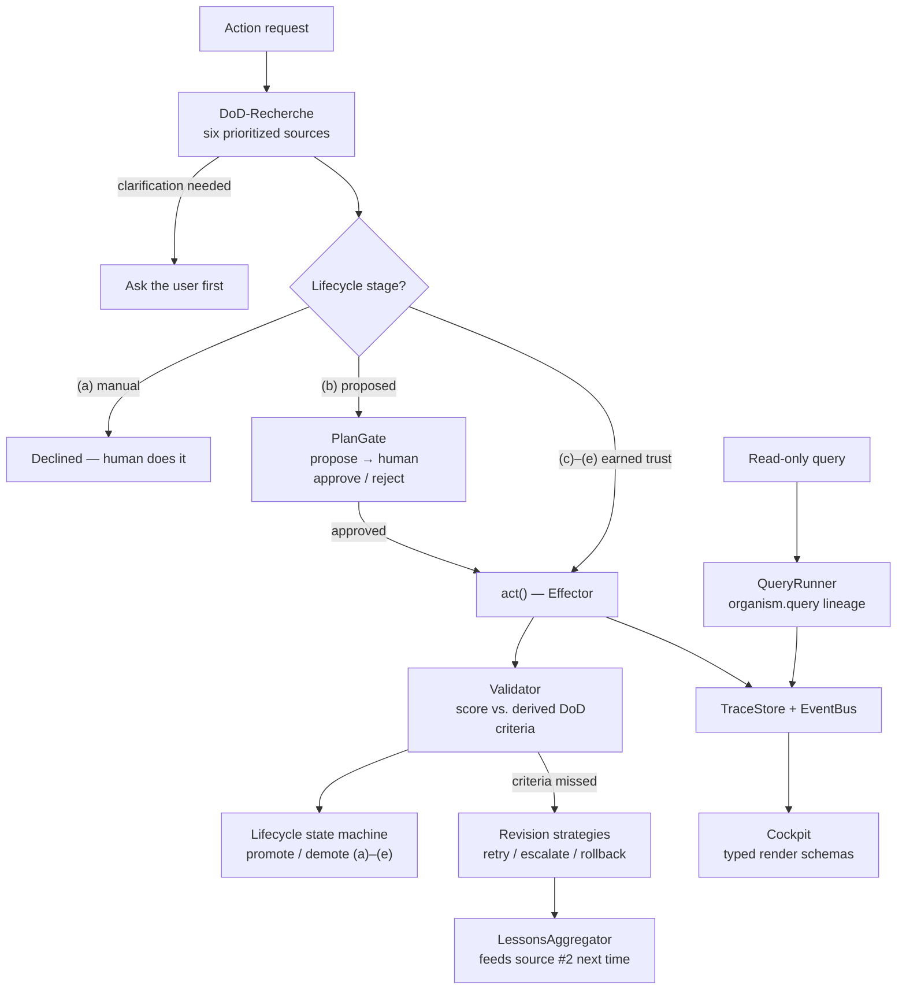

*[🇩🇪 Deutsche Version](README.de.md)*

# organism-core

[](https://github.com/organism-core/organism-core/actions/workflows/ci.yml)
[](LICENSE)
[](pyproject.toml)

**The Advanced Agentic Harness — quality-gated multi-tool AI orchestration.**

Reference implementation of a pattern set for safe multi-tool agent systems: researches a Definition-of-Done before every action, validates the result against the derived criteria, drives per-action-type autonomy from the score history — and revokes it automatically on drift. In three words: **safety, cross-arm learning, robust harness design.**

## Industry convergence — May 2026

Within a single week in May 2026, three top-tier actors published designs that converge on the same meta-problem: the monolithic request-response cycle does not fit the reality of ongoing user attention and continuous agent action.

- **Anthropic Outcomes** (mid-May 2026) — explicit success criteria before action, validation after. Architecturally adjacent to organism-core's M5 DoD-research pattern.
- **TML Interaction Models** (Thinking Machines Lab, May 12 research preview) — "listen, speak, see, pause" trained into a single network; full-duplex; ~0.4 s response latency. Solves turn-taking at the **architecture layer**.
- **Google Android Halo** (May 19, I/O) — persistent agent-state indicator in the Android status bar, shipping with Android 17 later this year. Surfaces ongoing agent action at the **OS / UI layer**.

organism-core targets the same meta-problem at a third level — the **protocol layer**. Plan-Gate + Lifecycle + DoD-Engine + the reserved Reentrance pattern (see [`docs/REENTRANCE.md`](docs/REENTRANCE.md)) deliver mid-execution human-in-the-loop with an auditable trail across multiple tools.

The four approaches do not compete; they layer:

| Layer | Example | What it solves |
|---|---|---|
| Provider | Anthropic Outcomes | success criteria as first-class API |
| Architecture (model) | TML Interaction Models | mid-utterance bidirectional attention |
| **Protocol (orchestration)** | **organism-core** | **mid-execution HITL with audit trail** |
| UI (OS / app) | Android Halo | persistent agent-state visibility |

organism-core is the provider-agnostic open-source implementation at the protocol layer.

**Status**: Feature-complete reference implementation, pre-1.0. See [Phase status](#phase-status) for detail. 899 tests green.

<p align="center">
  
</p>

> organism-core is a **finished reference pattern set** — self-hostable, Apache 2.0, maintained in preservation mode. A hosted SaaS layer built on it runs in private beta with our first production consumer; the SaaS orchestrates *over* your existing tools (mail, tickets, CAD, invoicing, docs, …), not as a replacement for them. Contact: `info@brachia.dev`.

## What is this?

An opinionated pattern set for systems where multiple AI tools work in parallel and consolidate their results into a central truth store. The Skelett (German for "skeleton" — the generic core) ships generic building blocks (DoD engine, lifecycle state machine, plan gate, lessons aggregator, trace store, event bus, Cockpit). Consumers implement concrete effectors and queriers for their own domain.

A few German-origin terms are kept on purpose as project vocabulary (Skelett, Wesen, DoD-Recherche) — see the [mini-glossary](docs/TRANSLATION_GUIDE.md#mini-glossary--project-vocabulary).

## Why this exists?

Built at a working architecture practice with ~300 active projects. We needed an agent system that learns from corrections instead of repeating mistakes, and that earns autonomy instead of being granted it.

## How it works

Imagine you want an AI to handle a task for you automatically — say, evaluate a floor plan, answer an incoming email, check a tax return. Before the AI starts working, organism-core asks a different question: **What does "done" actually mean here — for this project, in this context, at this moment?**

The framework looks for the answer in six places, moving from concrete to general:

1. **In the project's own profile** — does it already say what this task should deliver? (Example: "the evaluation must show at least 12 rooms.")
2. **In past experience** — what did we learn from similar tasks? (Example: "last time the AI missed doors — we now check for complete door lists.")
3. **In related projects** — how was this task handled in similar cases?
4. **In a semantic search** over the available knowledge base — are there comparable cases in the archive?
5. **In domain patterns** — what are the usual requirements for this kind of task?
6. **With the human** — when the five above don't give enough, a clarifying question goes back to the user.

From those six answers the framework assembles a concrete list — the **Definition of Done**. Only then does the AI start its actual work. At the end the framework checks: does the result satisfy that list?

- If yes: the result is stored, and the responsible tool path earns a piece of trust.
- If no: the framework decides automatically along configured rules — another attempt with different parameters, an escalation to a human, or a clean rollback.

Over time the system collects experience from successes and failures, feeds them back in as source #2 the next time, and tools that work cleanly repeatedly rise into a higher trust stage automatically. Tools that miss too often get demoted. That is the **quality gate** that sets organism-core apart from other multi-agent frameworks — the AI has to earn its autonomy, it does not get it for free.

## What makes this different

The parts are not the point — the big platforms ship most of them individually. The point is that nobody ships them **fused into one execution path**: DoD research → plan gate → earned autonomy → validation → persistent lessons. organism-core is that path, as a provider-agnostic harness you can read in an afternoon.

Three primitives carry the claim (state June 2026, sources dated):

1. **Persistent cross-arm lessons.** Failure insights are distilled, persisted, and re-injected at the next DoD derivation — including **across action types** (`CrossDomainLessonsSource`, the open-source analogue of Anthropic's Dreaming). Rubric-feedback loops are appearing elsewhere (LangChain deepagents RubricMiddleware 06/2026, Anthropic Outcomes beta 05/2026); structured, configurable cross-arm redistribution as a first-class primitive has no other published implementation we know of.

2. **Score-driven autonomy per action type.** Effectors earn stages `(a)→(e)` from demonstrated quality (rolling average score) — per action kind, not per agent. This matches what the literature now calls the Digital-Apprentice model (arXiv 2606.04321, June 2026: per-skill tiers, promotion as competence evidence) — published there as concept; this repo ships a tested implementation. The DoD itself is researched from six prioritized semantic sources before every action (detail in [`docs/M5_WHITEPAPER.md`](docs/M5_WHITEPAPER.md)).

3. **Auto-demotion as a security feature.** Granted autonomy is revocable by construction: drift in the score window demotes the action type automatically. Excessive, irrevocable agent autonomy is a core risk in the OWASP Agentic Top 10 (2026) — revocability is this harness's structural answer, not a bolt-on policy.

What we deliberately do **not** claim as differentiation: the plan gate (HITL approval is commodity across OpenAI, LangGraph, Microsoft, Google, and CrewAI, and EU AI Act Art. 14 makes human oversight mandatory anyway — ours is specific only in gating **plan objects with a diff against file truth** rather than raw tool calls), and file-first YAML/Markdown memory (the industry default by 2026). Both are load-bearing building blocks here; neither is why you would pick this repo.

The cross-domain genericity guard — a CI test asserting that three demo domains produce identical pipeline counts — is an **architecture fitness function**, not a market claim: it keeps the framework honest about staying generic while it generalizes out of a real production domain.

Interop notes: an Anthropic-Outcomes Markdown rubric pastes straight into `MarkdownRubricSource` and feeds the same engine. And if you are migrating off a discontinued evaluation stack (OpenAI sunsets Agent Builder and its Evals platform on 2026-11-30), the validation path here — derived criteria, mechanical checks first, LLM judge only where needed, batched judging — is self-hostable and provider-agnostic.

Orthogonal to self-evolving agents (e.g. Hermes Agent): Hermes optimizes a single agent over time through skill generation. organism-core orchestrates multiple tools with per-action quality validation and lifecycle stages. The reasoning agent runs as an effector inside the orchestration; the orchestration enforces gates around it.

**Substrate for structured self-improvement, not a self-modifying agent.** organism-core provides the durable scaffolding — DoD criteria as evaluation rasters, revision strategies as decision branches, lessons and traces as persistent memory, lifecycle stages as performance tracking. The patterns themselves stay human-curated; only the content inside them grows (lessons accumulate, criteria sharpen, stages get earned). Research like the Hyperagent paper (Meta + UBC, 2026) shows emergent self-modification is possible; we deliberately stay one layer below: a stable substrate on which human-curated improvement happens predictably and auditably.

Read-only tools have their own narrow lineage (`organism.query`) that skips the DoD / plan-gate / lifecycle ceremony — details in [`CONTRIBUTING.md`](CONTRIBUTING.md).

## Architecture



The Skelett ships everything in this diagram except the two pieces
you fill in: consumers implement **Effectors** (side-effecting
tools, five-contact contract) and **Queriers** (deterministic reads,
two-contact contract). DoD research, plan gating, validation,
lifecycle, lessons, traces, and the Cockpit render layer come from
the framework.

## Recent additions

The most recent push lifts organism-core from "skeleton MVP" to
"production-ready core" with three groups of additions:

**Phase 8 — Outcomes interop and cross-domain transfer**
- `REVISION_OUTCOME_FAILED` (8A) — a terminal outcome distinct from
  "exhausted attempts". Surfaces when the rubric itself becomes
  incoherent with the request, mirroring Anthropic Outcomes'
  `failed` vs `max_iterations_reached` distinction.
- `MarkdownRubricSource` (8B) — parses Anthropic-Outcomes Markdown
  rubric format directly into `Criterion` objects. Drop-in interop for
  consumers who already maintain rubrics in that format.
- `CrossDomainLessonsSource` (8C) — pulls lessons recorded under
  *other* kinds when the request context shares enough match-keys.
  organism-core's analogue of Anthropic's Dreaming, run inline at
  DoD-derive time. Reduced weight factor on cross-kind transfer (the
  trust model treats same-kind lessons as primary signal).

**Production performance levers**
- **Batched `llm_judge` (P1)** — `DoDValidator` dispatches N criteria
  with `evaluator=llm_judge` to a single
  `EvaluationContext.batch_llm_judge` callable when ≥2 eligible
  criteria exist. Realistic 4-5× cost+latency reduction on
  rubric-driven DoDs.
- **Parallel source dispatch (P2)** — `DoDEngine(parallel=True)`
  dispatches all sources concurrently. Latency becomes
  `max(source_latencies)` instead of `sum`. Engine dedupes post-hoc;
  early-exit disabled in parallel mode.
- **Lesson-pile observability sensor (mini-P3)** —
  `LessonsAggregator.usage_stats()` exposes `age_days_p95`,
  `recent_use_ratio`, `never_used_count`. Surfaced per kind on
  `Cockpit.summary()`. Build a distillation worker only when this
  sensor reports a real pile-up signal in production usage.

**Three former stub sources now real**
- `RelatedEntitiesSource` — prefix-cluster heuristic (`343_alpha`
  finds `343_beta`) plus tag-overlap heuristic (frontmatter `tags`
  intersection). Each heuristic ships as its own source instance with
  its own provenance bucket (`related_entities:prefix`,
  `related_entities:tags`).
- `DomainPatternSource` — `PatternRegistry` keyed by
  `(action_type, entity_type)`. Two source instances
  (`domain_pattern:tuple`, `domain_pattern:action_only`) for separate
  provenance tracks. organism-core ships only the registry interface;
  the domain knowledge lives in the consumer's setup.
- `VectorSearchSource` — duck-typed chromadb-compatible adapter
  (chromadb is **not** a dependency). Generic `default_query_builder`
  prioritises universal text fields (text/description/name/title/
  summary) plus `entity_id`/`kind`. V1 contributes one
  `similar_cases_present` criterion plus confidence proportional to
  hit count; aggregate hit-metadata is V2.

`default_sources()` now returns 8 source instances in canonical order
(was 6) because of the two-instance pattern. 899 tests green.

## Quick start

```bash
git clone https://github.com/organism-core/organism-core.git
cd organism-core
pip install -e ".[dev]"

# Run one of the three demo domains (action side, pipeline walk):
python -m examples.architect_lite    # Architecture practice
python -m examples.tax_lite          # Tax advisory
python -m examples.cfo_lite          # CFO office

# Or see the DoD-Recherche traversal across all six sources:
python -m examples.full_recherche

# Or the headless UI "Wesen" (Cockpit) in action:
python -m examples.cockpit_demo

# Run the tests:
pytest tests/
```

Not yet on PyPI — install from source as shown above.

The three domain demos print a complete pipeline walk to stdout
(setup → seeding → four steps: PROPOSED flow, CHECKED promotion,
AUTONOMOUS revision, HITL lesson). All three produce **identical
pipeline counts** — cross-domain verification as executable spec.

`full_recherche` is a fourth demo with a different focus: it shows
the **six-source hierarchy** of the DoD-Recherche engine (M5) in full
bloom, with consumer-facing wiring of the three external-backend
sources (RelatedEntities / VectorSearch / DomainPattern) — now real
implementations, no longer stubs.

`cockpit_demo` shows the Cockpit Wesen (German "Wesen" ≈
"entity/being" — the headless UI layer): it hovers over the
orchestrator and stores and emits typed render schemas (DoDView /
PlanApprovalView / DriftView / QueryTraceView) for any UI framework.

## Define your own effector

The complete consumer surface in ~40 lines — an effector with the two
contacts you override, wired into the orchestrator, one full
propose → approve → apply round trip
(`tests/examples/test_readme_example.py` keeps it honest in CI):

```python
import tempfile
from pathlib import Path

from organism.adapter import BaseEffector
from organism.dod import DoDEngine, DoDEngineSettings, DoDValidator, default_sources
from organism.lifecycle import LifecycleManager, LifecycleStore
from organism.memory import Entity, EntityStore
from organism.orchestrator import ActionOrchestrator
from organism.plan_gate import PlanGate, PlanStore


class GreetingEffector(BaseEffector):
    name = "greeting_effector"

    def define_done(self, request, context):
        return {}  # let the DoD engine derive the criteria

    def act(self, request):
        return {"greeting_present": True}


root = Path(tempfile.mkdtemp())
entities = EntityStore(root / "entities")
entities.write("demo-entity", Entity(frontmatter={
    "dod": {"criteria": [{"name": "greeting_present", "expected": True}]},
}))

orchestrator = ActionOrchestrator(
    engine=DoDEngine(
        sources=default_sources(entity_store=entities),
        settings=DoDEngineSettings(threshold=0.5),
    ),
    validator=DoDValidator(),
    plan_gate=PlanGate(store=PlanStore(root / "plans")),
    lifecycle=LifecycleManager(store=LifecycleStore(root / "lifecycle")),
)

effector = GreetingEffector()
result = orchestrator.execute(
    effector, kind="say_hello", request="hello",
    context={"entity_id": "demo-entity"},
)
print(result.status)  # ActionStatus.PROPOSED — waiting for human approval

orchestrator.plan_gate.approve(result.plan.id, decided_by="you")
applied = orchestrator.apply_approved_plan(result.plan.id, effector)
print(applied.status, applied.validation.score)  # ActionStatus.APPLIED 1.0
```

The new `kind` starts in lifecycle stage `(b) proposed`, so every
action goes through the PlanGate until the score history has earned a
promotion — that is the quality gate doing its job.

## Reading paths

| Who you are | Read |
|---|---|
| First overview | [`docs/M5_WHITEPAPER.md`](docs/M5_WHITEPAPER.md) (single document) |
| DoD engine in depth | [`docs/STAR.md`](docs/STAR.md) |
| Plan gate + lifecycle | [`docs/LIFECYCLE.md`](docs/LIFECYCLE.md) |
| Observability + lessons | [`docs/OBSERVABILITY.md`](docs/OBSERVABILITY.md) |
| Demos + genericity proof | [`docs/DEMOS.md`](docs/DEMOS.md) |
| Architecture concepts (German) | [`docs/ARCHITEKTUR/INDEX.en.md`](docs/ARCHITEKTUR/INDEX.en.md) (English chapter index) |
| Governance + separation contract | [`docs/STRATEGIE-EXTRACT.md`](docs/STRATEGIE-EXTRACT.md) |
| Two-language convention | [`docs/TRANSLATION_GUIDE.md`](docs/TRANSLATION_GUIDE.md) |

Doc index: [`docs/README.md`](docs/README.md).

## Modules

| Path | Job | Phase |
|---|---|---|
| `src/organism/memory/` | Entity memory (YAML+MD per entity), schema-free | ✅ 1 |
| `src/organism/adapter/` | Five-contact effector contract (Protocol + BaseEffector + ReadEffector) | ✅ 1 |
| `src/organism/query/` | Two-contact querier contract + QueryRunner (read-only path) | ✅ Q |
| `src/organism/dod/` | DoD-Recherche engine (star pattern, M5) — core | ✅ 2 |
| `src/organism/settings/` | YAML-round-trippable settings + admin-UI registry | ✅ 3 |
| `src/organism/plan_gate/` | Approve/reject service with file-backed plan persistence | ✅ 3 |
| `src/organism/lifecycle/` | State machine `(a)→(e)` with avg-score-driven transitions | ✅ 3 |
| `src/organism/orchestrator/` | ActionOrchestrator: stage routing + AUTONOMOUS revision loop | ✅ 3+5 |
| `src/organism/provenance/` | Provenance container (author / source / confidence / ...) | ✅ 4 |
| `src/organism/observability/` | TraceStore + QueryTraceStore, EventBus, ToolRegistry, OTel-GenAI converter, Langfuse stub | ✅ 4 |
| `src/organism/lessons/` | LessonsAggregator + LessonsSource | ✅ 4 |
| `src/organism/ui/` | Cockpit + render schemas + UIEventStream (headless UI layer) | ✅ UI |

## Demo domains

`examples/<demo>/` — parallel mini demos as a genericity discipline.
Whatever does not run in all three is too domain-specific:

- `examples/architect_lite/` — Architecture-practice-lite (floor-plan
  extraction effector + lookup querier)
- `examples/tax_lite/` — Tax-advisory-lite (tax-return validation +
  querier)
- `examples/cfo_lite/` — CFO-lite (quarterly close + cost-center
  querier)
- `examples/full_recherche/` — Shows the six-source DoD-Recherche
  hierarchy
- `examples/cockpit_demo/` — Shows the Cockpit Wesen with all render
  schemas

Each domain demo is self-contained (~300 lines) — usable as a
template for your own domain.

## Phase status

| Phase | Status | Content |
|---|---|---|
| 0 | ✅ | Repo init, empty module structure |
| 1 | ✅ | Memory + effector contract (BaseEffector + ReadEffector) |
| 2 | ✅ | DoD engine + six sources + validator |
| 3 | ✅ | Settings + PlanGate + Lifecycle + Orchestrator |
| 4 | ✅ | Provenance + trace + lessons + EventBus + OTel + Langfuse |
| 5 | ✅ | AUTONOMOUS revision + event wiring + three demos + cross-demo test |
| 6 | ✅ | Doc consolidation + M5 whitepaper + LICENSE + CI |
| 7 | ✅ | M5-patch code: evaluator switch + lesson loop + revision strategies + operative settings |
| UI | ✅ | Cockpit Wesen + render schemas + UIEventStream + CockpitBuilder |
| Q | ✅ | Querier lineage (read-only): protocol + runner + QueryTrace + Cockpit integration |
| 8A | ✅ | Outcomes-alignment: `REVISION_OUTCOME_FAILED` + Anthropic-bridge framing |
| 8B | ✅ | `MarkdownRubricSource` — Anthropic-Outcomes rubric-format interop |
| 8C | ✅ | `CrossDomainLessonsSource` — cross-kind lesson transfer (Dreaming-equivalent) |
| P1 | ✅ | Batched `llm_judge` — N→1 LLM call reduction per validation |
| P2 | ✅ | Parallel source dispatch — `max(latencies)` instead of `sum` |
| P3-mini | ✅ | Lesson-pile observability sensor on `Cockpit.summary()` |
| S | ✅ | Three former stub sources now real (clustering / pattern-registry / vector-search adapter); `default_sources()` returns 8 instances in canonical order |

## Test

```bash
pytest tests/
```

899 tests green. Two separation-test guards:
- `tests/examples/test_cross_demo.py` — Action side: all three domain
  demos produce identical pipeline counts.
- `tests/examples/test_cross_demo_queries.py` — Query side: all three
  domain queriers produce identical trace counts.

`tests/examples/test_m5_features.py` is the M5-patch-code guard for
the per-domain features (evaluator / revision strategies / operative
settings).

## License

Apache License 2.0 — see [`LICENSE`](LICENSE).

Contributions are accepted under the project's Contributor License
Agreement (see [`CLA.md`](CLA.md)). You keep copyright to your
contribution; you grant the project the rights needed to ship and
evolve it.

## Repository

https://github.com/organism-core/organism-core

---

*Human is curator, AI is proposal.*
