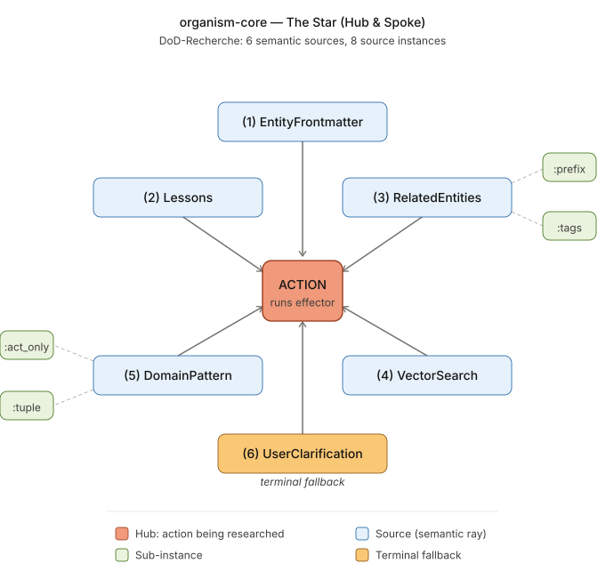

*[🇩🇪 Deutsche Version](README.de.md)*

# organism-core

**Quality-gated multi-tool AI orchestration.**

Reference implementation that researches a Definition-of-Done before every action, validates the result against the derived criteria, and drives lifecycle stages from the score history. Delivers an orthogonal quality-gate to single-agent frameworks (e.g. Hermes, LangChain).

## Hint

The M5 pattern in organism-core predates and converges with Anthropic's Outcomes feature (announced May 2026). Both designs arrive independently at the same architecture — DoD-research, separator-grader, iteration-loop. We treat this convergence as validation that the pattern is right, and organism-core remains the provider-agnostic open-source implementation

**Status**: Phases 0-8 + Cockpit UI layer + Querier lineage + production performance levers (batched judge, parallel sources, lesson-pile sensor). 899 tests green.

<p align="center">
  
</p>

> **Looking for collaborators and design partners.**
>
> **Code collaborators:** organism-core is in alpha, the architecture is settled and the test coverage is real, but real-world consumers are what the framework needs next. If you build agentic systems, run a domain you'd like to test the pattern against, or want to harden the Skelett against a production workload — open an issue, send a PR, or write to `info@brachia.dev`.
>
> **Design partners (hosted SaaS, private beta):** We're building a hosted SaaS layer on top of organism-core, in private beta with our first production consumer (architecture practice). This public repository is an earlier snapshot — internally we're close to production. The SaaS orchestrates *over* your existing tools (Mail, Tickets, CAD, Invoicing, Docs, …), not a replacement for them. If your team coordinates across multiple tools and you'd discuss a 30-min discovery call about HITL-quality-gated agent workflows on your stack: `info@brachia.dev`.

## What is this?

An opinionated pattern set for systems where multiple AI tools work in parallel and consolidate their results into a central truth store. The Skelett ships generic building blocks (DoD engine, lifecycle state machine, plan gate, lessons aggregator, trace store, event bus, Cockpit). Consumers implement concrete effectors and queriers for their own domain.

## Why this exists?

Built at a working architecture practice with ~300 active projects. We needed an agent system that learns from corrections instead of repeating mistakes, and that earns autonomy instead of being granted it.

## How it works

Imagine you want an AI to handle a task for you automatically — say, evaluate a floor plan, answer an incoming email, check a tax return. Before the AI starts working, organism-core asks a different question: **What does "done" actually mean here — for this project, in this context, at this moment?**

The framework looks for the answer in six places, moving from concrete to general:

1. **In the project's own profile** — does it already say what this task should deliver? (Example: "the evaluation must show at least 12 rooms.")
2. **In past experience** — what did we learn from similar tasks? (Example: "last time the AI missed doors — we now check for complete door lists.")
3. **In related projects** — how was this task handled in similar cases?
4. **In a semantic search** over the available knowledge base — are there comparable cases in the archive?
5. **In domain patterns** — what are the usual requirements for this kind of task?
6. **With the human** — when the five above don't give enough, a clarifying question goes back to the user.

From those six answers the framework assembles a concrete list — the **Definition of Done**. Only then does the AI start its actual work. At the end the framework checks: does the result satisfy that list?

- If yes: the result is stored, and the responsible tool path earns a piece of trust.
- If no: the framework decides automatically along configured rules — another attempt with different parameters, an escalation to a human, or a clean rollback.

Over time the system collects experience from successes and failures, feeds them back in as source #2 the next time, and tools that work cleanly repeatedly rise into a higher trust stage automatically. Tools that miss too often get demoted. That is the **quality gate** that sets organism-core apart from other multi-agent frameworks — the AI has to earn its autonomy, it does not get it for free.

## What makes this different

Do you like Anthropic Outcomes? Organism-core has more sources, HITL- aproval-layer, live-cycle stages and yeah: open-source/ self-hostable! You can paste an Anthropic-Outcomes Markdown rubric straight into a `MarkdownRubricSource` and feed it into the same engine.

Three primitives that the established multi-agent frameworks (LangGraph, CrewAI, AutoGen, Microsoft Agent Framework, AgentScope) do **not** expose as first-class:

1. **DoD-Recherche as pre-action research.** Before every action with external effect, the system researches the Definition of Done from six prioritized semantic sources (entity profile, lessons, related entities, vector search, domain patterns, user clarification). `related_entities` and `domain_pattern` each ship as two source instances (prefix/tags, tuple/action-only) so the engine emits separate provenance buckets — eight source instances in the default pipeline. Validates the result against the derived criteria after `act()`. Detail in [`docs/M5_WHITEPAPER.md`](docs/M5_WHITEPAPER.md).

2. **Cross-domain genericity as executable spec.** A CI test asserts that three demo domains (for example architecture, tax, CFO) produce identical pipeline counts. If a contribution accidentally makes the framework domain-specific, the test breaks. No other framework publishes this kind of automated genericity guard.

3. **Score-driven lifecycle stages.** Effectors promote `(a)→(b)→(c)→(d)→(e)` based on demonstrated quality (avg score over a rolling window) and demote on drift. Stages are not badges — they are earned and revoked automatically.

Orthogonal to self-evolving agents (e.g. Hermes Agent): Hermes optimizes a single agent over time through skill generation. organism-core orchestrates multiple tools with per-action quality validation and lifecycle stages. The reasoning agent runs as an effector inside the orchestration; the orchestration enforces gates around it.

**Substrate for structured self-improvement, not a self-modifying agent.** organism-core provides the durable scaffolding — DoD criteria as evaluation rasters, revision strategies as decision branches, lessons and traces as persistent memory, lifecycle stages as performance tracking. The patterns themselves stay human-curated; only the content inside them grows (lessons accumulate, criteria sharpen, stages get earned). Research like the Hyperagent paper (Meta + UBC, 2026) shows emergent self-modification is possible; we deliberately stay one layer below: a stable substrate on which human-curated improvement happens predictably and auditably.

Read-only tools have their own narrow lineage (`organism.query`) that skips the DoD / plan-gate / lifecycle ceremony — details in [`CONTRIBUTING.md`](CONTRIBUTING.md).

## Recent additions

The most recent push lifts organism-core from "skeleton MVP" to
"production-ready core" with three groups of additions:

**Phase 8 — Outcomes interop and cross-domain transfer**
- `REVISION_OUTCOME_FAILED` (8A) — a terminal outcome distinct from
  "exhausted attempts". Surfaces when the rubric itself becomes
  incoherent with the request, mirroring Anthropic Outcomes'
  `failed` vs `max_iterations_reached` distinction.
- `MarkdownRubricSource` (8B) — parses Anthropic-Outcomes Markdown
  rubric format directly into `Criterion` objects. Drop-in interop for
  consumers who already maintain rubrics in that format.
- `CrossDomainLessonsSource` (8C) — pulls lessons recorded under
  *other* kinds when the request context shares enough match-keys.
  organism-core's analogue of Anthropic's Dreaming, run inline at
  DoD-derive time. Reduced weight factor on cross-kind transfer (the
  trust model treats same-kind lessons as primary signal).

**Production performance levers**
- **Batched `llm_judge` (P1)** — `DoDValidator` dispatches N criteria
  with `evaluator=llm_judge` to a single
  `EvaluationContext.batch_llm_judge` callable when ≥2 eligible
  criteria exist. Realistic 4-5× cost+latency reduction on
  rubric-driven DoDs.
- **Parallel source dispatch (P2)** — `DoDEngine(parallel=True)`
  dispatches all sources concurrently. Latency becomes
  `max(source_latencies)` instead of `sum`. Engine dedupes post-hoc;
  early-exit disabled in parallel mode.
- **Lesson-pile observability sensor (mini-P3)** —
  `LessonsAggregator.usage_stats()` exposes `age_days_p95`,
  `recent_use_ratio`, `never_used_count`. Surfaced per kind on
  `Cockpit.summary()`. Build a distillation worker only when this
  sensor reports a real pile-up signal in production usage.

**Three former stub sources now real**
- `RelatedEntitiesSource` — prefix-cluster heuristic (`343_alpha`
  finds `343_beta`) plus tag-overlap heuristic (frontmatter `tags`
  intersection). Each heuristic ships as its own source instance with
  its own provenance bucket (`related_entities:prefix`,
  `related_entities:tags`).
- `DomainPatternSource` — `PatternRegistry` keyed by
  `(action_type, entity_type)`. Two source instances
  (`domain_pattern:tuple`, `domain_pattern:action_only`) for separate
  provenance tracks. organism-core ships only the registry interface;
  the domain knowledge lives in the consumer's setup.
- `VectorSearchSource` — duck-typed chromadb-compatible adapter
  (chromadb is **not** a dependency). Generic `default_query_builder`
  prioritises universal text fields (text/description/name/title/
  summary) plus `entity_id`/`kind`. V1 contributes one
  `similar_cases_present` criterion plus confidence proportional to
  hit count; aggregate hit-metadata is V2.

`default_sources()` now returns 8 source instances in canonical order
(was 6) because of the two-instance pattern. 899 tests green.

## Quick start

```bash
git clone git@github.com:organism-core/organism-core.git
cd organism-core
pip install -e ".[dev]"

# Run one of the three demo domains (action side, pipeline walk):
python -m examples.architect_lite    # Architecture practice
python -m examples.tax_lite          # Tax advisory
python -m examples.cfo_lite          # CFO office

# Or see the DoD-Recherche traversal across all six sources:
python -m examples.full_recherche

# Or the headless UI "Wesen" (Cockpit) in action:
python -m examples.cockpit_demo

# Run the tests:
pytest tests/
```

The three domain demos print a complete pipeline walk to stdout
(setup → seeding → four steps: PROPOSED flow, CHECKED promotion,
AUTONOMOUS revision, HITL lesson). All three produce **identical
pipeline counts** — cross-domain verification as executable spec.

`full_recherche` is a fourth demo with a different focus: it shows
the **six-source hierarchy** of the DoD-Recherche engine (M5) in full
bloom, with consumer-facing wiring of the three external-backend
sources (RelatedEntities / VectorSearch / DomainPattern) — now real
implementations, no longer stubs.

`cockpit_demo` shows the headless UI Wesen — the Cockpit hovers over
the orchestrator and stores and emits typed render schemas (DoDView /
PlanApprovalView / DriftView / QueryTraceView) for any UI framework.

## Reading paths

| Who you are | Read |
|---|---|
| First overview | [`docs/M5_WHITEPAPER.md`](docs/M5_WHITEPAPER.md) (single document) |
| DoD engine in depth | [`docs/STAR.md`](docs/STAR.md) |
| Plan gate + lifecycle | [`docs/LIFECYCLE.md`](docs/LIFECYCLE.md) |
| Observability + lessons | [`docs/OBSERVABILITY.md`](docs/OBSERVABILITY.md) |
| Demos + genericity proof | [`docs/DEMOS.md`](docs/DEMOS.md) |
| Architecture concepts (German) | [`docs/ARCHITEKTUR/INDEX.en.md`](docs/ARCHITEKTUR/INDEX.en.md) (English chapter index) |
| Governance + separation contract | [`docs/STRATEGIE-EXTRACT.md`](docs/STRATEGIE-EXTRACT.md) |
| Two-language convention | [`docs/TRANSLATION_GUIDE.md`](docs/TRANSLATION_GUIDE.md) |

Doc index: [`docs/README.md`](docs/README.md).

## Modules

| Path | Job | Phase |
|---|---|---|
| `src/organism/memory/` | Entity memory (YAML+MD per entity), schema-free | ✅ 1 |
| `src/organism/adapter/` | Five-contact effector contract (Protocol + BaseEffector + ReadEffector) | ✅ 1 |
| `src/organism/query/` | Two-contact querier contract + QueryRunner (read-only path) | ✅ Q |
| `src/organism/dod/` | DoD-Recherche engine (star pattern, M5) — core | ✅ 2 |
| `src/organism/settings/` | YAML-round-trippable settings + admin-UI registry | ✅ 3 |
| `src/organism/plan_gate/` | Approve/reject service with file-backed plan persistence | ✅ 3 |
| `src/organism/lifecycle/` | State machine `(a)→(e)` with avg-score-driven transitions | ✅ 3 |
| `src/organism/orchestrator/` | ActionOrchestrator: stage routing + AUTONOMOUS revision loop | ✅ 3+5 |
| `src/organism/provenance/` | Provenance container (author / source / confidence / ...) | ✅ 4 |
| `src/organism/observability/` | TraceStore + QueryTraceStore, EventBus, ToolRegistry, OTel-GenAI converter, Langfuse stub | ✅ 4 |
| `src/organism/lessons/` | LessonsAggregator + LessonsSource | ✅ 4 |
| `src/organism/ui/` | Cockpit + render schemas + UIEventStream (headless UI layer) | ✅ UI |

## Demo domains

`examples/<demo>/` — parallel mini demos as a genericity discipline.
Whatever does not run in all three is too domain-specific:

- `examples/architect_lite/` — Architecture-practice-lite (floor-plan
  extraction effector + lookup querier)
- `examples/tax_lite/` — Tax-advisory-lite (tax-return validation +
  querier)
- `examples/cfo_lite/` — CFO-lite (quarterly close + cost-center
  querier)
- `examples/full_recherche/` — Shows the six-source DoD-Recherche
  hierarchy
- `examples/cockpit_demo/` — Shows the Cockpit Wesen with all render
  schemas

Each domain demo is self-contained (~300 lines) — usable as a
template for your own domain.

## Phase status

| Phase | Status | Content |
|---|---|---|
| 0 | ✅ | Repo init, empty module structure |
| 1 | ✅ | Memory + effector contract (BaseEffector + ReadEffector) |
| 2 | ✅ | DoD engine + six sources + validator |
| 3 | ✅ | Settings + PlanGate + Lifecycle + Orchestrator |
| 4 | ✅ | Provenance + trace + lessons + EventBus + OTel + Langfuse |
| 5 | ✅ | AUTONOMOUS revision + event wiring + three demos + cross-demo test |
| 6 | ✅ | Doc consolidation + M5 whitepaper + LICENSE + CI |
| 7 | ✅ | M5-patch code: evaluator switch + lesson loop + revision strategies + operative settings |
| UI | ✅ | Cockpit Wesen + render schemas + UIEventStream + CockpitBuilder |
| Q | ✅ | Querier lineage (read-only): protocol + runner + QueryTrace + Cockpit integration |
| 8A | ✅ | Outcomes-alignment: `REVISION_OUTCOME_FAILED` + Anthropic-bridge framing |
| 8B | ✅ | `MarkdownRubricSource` — Anthropic-Outcomes rubric-format interop |
| 8C | ✅ | `CrossDomainLessonsSource` — cross-kind lesson transfer (Dreaming-equivalent) |
| P1 | ✅ | Batched `llm_judge` — N→1 LLM call reduction per validation |
| P2 | ✅ | Parallel source dispatch — `max(latencies)` instead of `sum` |
| P3-mini | ✅ | Lesson-pile observability sensor on `Cockpit.summary()` |
| S | ✅ | Three former stub sources now real (clustering / pattern-registry / vector-search adapter); `default_sources()` returns 8 instances in canonical order |

## Test

```bash
pytest tests/
```

899 tests green. Two separation-test guards:
- `tests/examples/test_cross_demo.py` — Action side: all three domain
  demos produce identical pipeline counts.
- `tests/examples/test_cross_demo_queries.py` — Query side: all three
  domain queriers produce identical trace counts.

`tests/examples/test_m5_features.py` is the M5-patch-code guard for
the per-domain features (evaluator / revision strategies / operative
settings).

## License

Apache License 2.0 — see [`LICENSE`](LICENSE).

Contributions are accepted under the project's Contributor License
Agreement (see [`CLA.md`](CLA.md)). You keep copyright to your
contribution; you grant the project the rights needed to ship and
evolve it.

## Repository

https://github.com/organism-core/organism-core

---

*Human is curator, AI is proposal.*
