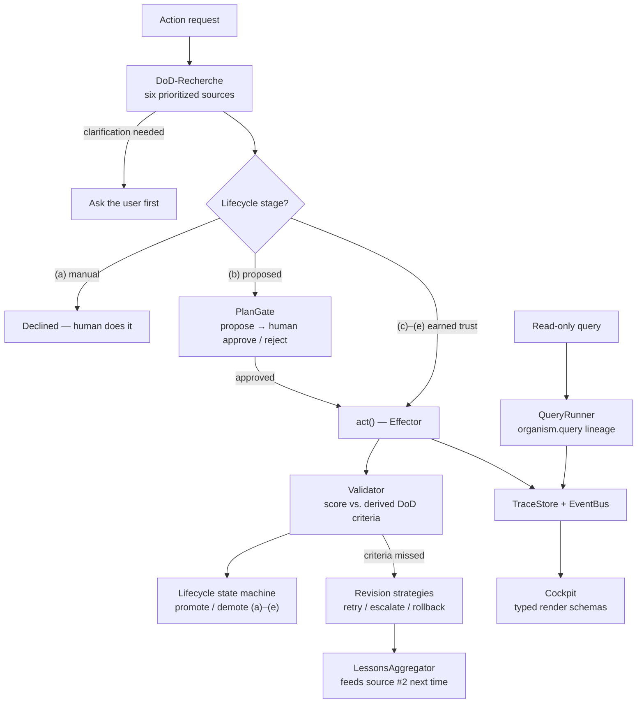

*[🇩🇪 Deutsche Version](README.de.md)*

# organism-core

[](https://github.com/organism-core/organism-core/actions/workflows/ci.yml)
[](LICENSE)
[](pyproject.toml)

**Multi-tool AI orchestration that researches its success criteria before it acts — validates against them afterwards — and earns autonomy from its own track record.**

Before an AI tool runs, organism-core settles one question: *what does "done" actually mean here?* After the action, it checks the result against exactly those criteria. Tools that repeatedly deliver get to do more on their own; tools that drift are demoted automatically. Self-hostable, Apache 2.0.

> **Status:** Feature-complete reference implementation, pre-1.0. 900 tests green. [Phase status](#phase-status).
>
> **The Advanced Agentic Harness** — a finished reference pattern set, maintained in preservation mode. **organism-core Cloud** *(in evaluation)*: hosted approval gate & audit reports, EU-hosted (GDPR-first), designed for EU AI Act Art. 14 evidence. Join the waitlist at [brachia.dev](https://brachia.dev) · `info@brachia.dev`.

<p align="center">
  
</p>

## What is this?

A pattern set for systems where several AI tools work in parallel and consolidate their results into one central "truth store". The Skelett (German for "skeleton" — the generic core) ships the generic building blocks: DoD engine, lifecycle state machine, plan gate, lessons aggregator, trace store, event bus, Cockpit. You implement the concrete tools for your domain — the framework brings everything else.

## Why does this exist?

Built inside a working architecture practice with ~300 active projects. We needed an agent system that learns from corrections instead of repeating mistakes — and that earns its autonomy instead of being handed it.

## How it works

Say you want an AI to handle a task for you — evaluate a floor plan, answer an incoming email, check a tax return. Before it starts, organism-core asks a different question first: **what does "done" mean concretely — for this project, in this context, right now?**

It looks for the answer in six places, from the specific to the general:

1. **In the project's own profile** — does it already state what this task must deliver? (Example: "the evaluation must show at least 12 rooms.")
2. **In past experience** — what did we learn from similar tasks? (Example: "last time the AI missed doors — we now check for complete door lists.")
3. **In related projects** — how was this handled in comparable cases?
4. **In a semantic search** over the knowledge base — are there similar cases in the archive?
5. **In domain patterns** — what are the usual requirements for this kind of task?
6. **With the human** — when the five above don't suffice, a clarifying question comes back to you.

From those six answers the Skelett assembles a concrete list — the **Definition of Done**. Only then does the AI start its actual work. At the end, the Skelett checks: does the result satisfy that list?

- **If yes:** the result is stored, and the responsible tool path earns a piece of trust for the next request.
- **If no:** the Skelett decides along configured rules — another attempt with different parameters, a report back to the user, or a clean rollback.

Over time the system collects experience from successes and failures and feeds it back in as source #2 the next time. Tools that repeatedly deliver rise into a higher trust stage automatically; tools that miss too often get demoted. That is the **quality gate** that sets organism-core apart from other multi-agent frameworks: the AI has to earn its autonomy — it doesn't get it for free.

## What makes this different

The individual parts are not what matters — the big platforms have most of them. The point is that nobody has **fused them into one execution path**: DoD research → plan gate → earned autonomy → validation → persistent lessons. organism-core is exactly that path, as a provider-agnostic harness.

Three cores make the difference:

1. **Persistent cross-arm lessons.** What a failure taught the system gets distilled, stored, and fed back in next time — including across action types. Rubric feedback loops are everywhere by now; a structured, configurable redistribution of those lessons across domains - as a first-class building block - apparently no one else.

2. **Earned autonomy per action type.** Tools climb five trust stages `(a)→(e)` through demonstrated quality — per action type, not per agent. And the success criteria they are measured against are researched fresh before every action, not hard-wired once.

3. **Auto-demotion as a security feature.** Granted autonomy is revocable by construction: if quality drops inside the score window, the action type is demoted automatically. Not a bolted-on policy — built into the architecture.

*(How this maps onto the 2026 AI landscape — Anthropic Outcomes, EU AI Act Art. 14, OWASP Agentic Top 10, MCP/A2A, the relevant research — is in [`docs/ARCHITEKTUR/10_LANDSCHAFT.md`](docs/ARCHITEKTUR/10_LANDSCHAFT.md), with dated sources.)*

## Architecture



The Skelett ships everything in this diagram - except the two pieces you fill in: **Effectors** (side-effecting tools, five-contact contract) and **Queriers** (deterministic reads, two-contact contract).

## Quick start

```bash
git clone https://github.com/organism-core/organism-core.git
cd organism-core
pip install -e ".[dev]"

python -m examples.architect_lite    # or tax_lite / cfo_lite
python -m examples.full_recherche    # the six-source DoD walk
python -m examples.cockpit_demo      # the headless UI layer
pytest tests/
```

Not yet on PyPI — install from source as shown above. The three domain demos generate a full pipeline walk and produce **identical pipeline counts** — cross-domain verification as executable spec.

## Define your own effector

The complete consumer surface in ~40 lines — an effector with the two contacts you override, wired into the orchestrator, one full propose → approve → apply round trip (`tests/examples/test_readme_example.py` guards the example in CI):

```python
import tempfile
from pathlib import Path

from organism.adapter import BaseEffector
from organism.dod import DoDEngine, DoDEngineSettings, DoDValidator, default_sources
from organism.lifecycle import LifecycleManager, LifecycleStore
from organism.memory import Entity, EntityStore
from organism.orchestrator import ActionOrchestrator
from organism.plan_gate import PlanGate, PlanStore


class GreetingEffector(BaseEffector):
    name = "greeting_effector"

    def define_done(self, request, context):
        return {}  # let the DoD engine derive the criteria

    def act(self, request):
        return {"greeting_present": True}


root = Path(tempfile.mkdtemp())
entities = EntityStore(root / "entities")
entities.write("demo-entity", Entity(frontmatter={
    "dod": {"criteria": [{"name": "greeting_present", "expected": True}]},
}))

orchestrator = ActionOrchestrator(
    engine=DoDEngine(
        sources=default_sources(entity_store=entities),
        settings=DoDEngineSettings(threshold=0.5),
    ),
    validator=DoDValidator(),
    plan_gate=PlanGate(store=PlanStore(root / "plans")),
    lifecycle=LifecycleManager(store=LifecycleStore(root / "lifecycle")),
)

effector = GreetingEffector()
result = orchestrator.execute(
    effector, kind="say_hello", request="hello",
    context={"entity_id": "demo-entity"},
)
print(result.status)  # ActionStatus.PROPOSED — waiting for human approval

orchestrator.plan_gate.approve(result.plan.id, decided_by="you")
applied = orchestrator.apply_approved_plan(result.plan.id, effector)
print(applied.status, applied.validation.score)  # ActionStatus.APPLIED 1.0
```

The new `kind` starts in lifecycle stage `(b) proposed`, so every action goes through the PlanGate until the score history has earned a promotion — that is the quality gate doing its job.

## Going deeper

| | Read |
|---|---|
| The whole idea in one document | [`docs/M5_WHITEPAPER.md`](docs/M5_WHITEPAPER.md) |
| Engine, lifecycle, observability in depth | [`docs/STAR.md`](docs/STAR.md) · [`docs/LIFECYCLE.md`](docs/LIFECYCLE.md) · [`docs/OBSERVABILITY.md`](docs/OBSERVABILITY.md) |
| Patterns: transfers, production default, MCP | [`docs/RECEIPTED_TRANSFER.md`](docs/RECEIPTED_TRANSFER.md) · [`docs/PRODUCTION_DEFAULT.md`](docs/PRODUCTION_DEFAULT.md) · [`docs/MCP_DESIGN.md`](docs/MCP_DESIGN.md) |
| Everything, with reading paths | [`docs/README.md`](docs/README.md) |

## Modules

| Path | Job |
|---|---|
| `src/organism/dod/` | DoD research engine (star pattern, M5) — the core |
| `src/organism/adapter/` · `src/organism/query/` | Effector contract (write) · Querier lineage (read-only) |
| `src/organism/plan_gate/` · `src/organism/lifecycle/` | Approve/reject gate · trust stages `(a)→(e)` |
| `src/organism/lessons/` · `src/organism/memory/` | Lessons aggregator · entity memory (YAML+MD, schema-free) |
| `src/organism/observability/` · `src/organism/provenance/` | Traces, EventBus, ToolRegistry, OTel converter · provenance container |
| `src/organism/orchestrator/` · `src/organism/ui/` | ActionOrchestrator (stage routing, revision loop) · headless Cockpit |
| `src/organism/settings/` | Admin-visible, YAML-round-trippable settings |

Demos live in `examples/` (architect_lite / tax_lite / cfo_lite + full_recherche + cockpit_demo), each ~300 lines and usable as a template. All stores are file-based — the truth stays human-readable YAML + Markdown.

## Phase status

| Phase | Status | Content |
|---|---|---|
| 0–6 | ✅ | Skeleton MVP: memory, effector contract, DoD engine + six sources + validator, settings, plan gate, lifecycle, orchestrator, provenance, traces, lessons, EventBus, OTel, three demos + cross-demo guard, doc consolidation, LICENSE + CI |
| 7 | ✅ | M5 patch code: evaluator switch (rule / self_check / llm_judge), closed lesson loop, per-criterion revision strategies, operative settings |
| UI · Q | ✅ | Cockpit Wesen + typed render schemas · querier lineage with QueryTrace |
| 8A–8C | ✅ | Outcomes alignment: `REVISION_OUTCOME_FAILED`, `MarkdownRubricSource` (Outcomes rubric interop), `CrossDomainLessonsSource` |
| P1 · P2 · P3-mini | ✅ | Batched `llm_judge` (N→1 calls) · parallel source dispatch · lesson-pile sensor |
| S | ✅ | Three former stub sources real; `default_sources()` returns 8 instances |

Planned extensions (no dates): dLLM integration · reentrance triggers 1–2 ([`docs/REENTRANCE.md`](docs/REENTRANCE.md)) · see [`docs/RELEASE_NOTES_v0.3.0.md`](docs/RELEASE_NOTES_v0.3.0.md) for what changed last.

## Test

```bash
pytest tests/
```

900 tests green (action and query side included), forcing identical counts across all three demo domains, plus a guard that keeps the README example compiling against the real API.

## License

Apache License 2.0 — see [`LICENSE`](LICENSE). Contributions are accepted under the project's CLA (see [`CLA.md`](CLA.md)); you keep copyright to your contribution.

---

*Human is curator, AI is proposal.*
